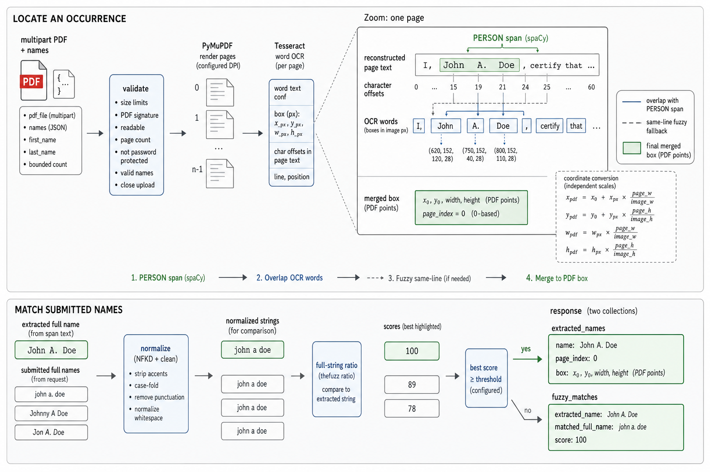
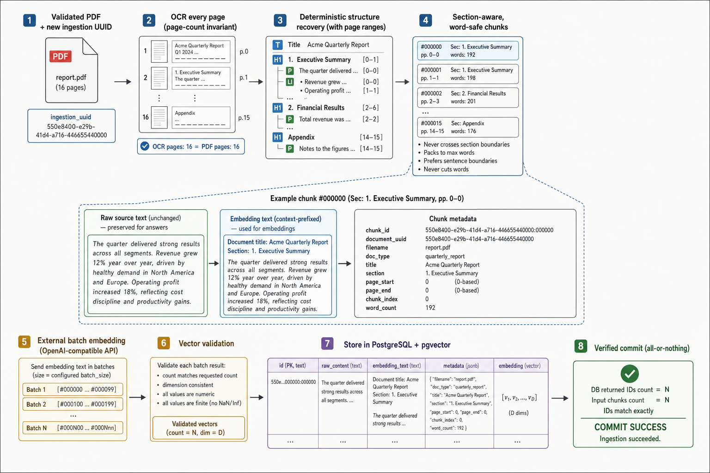
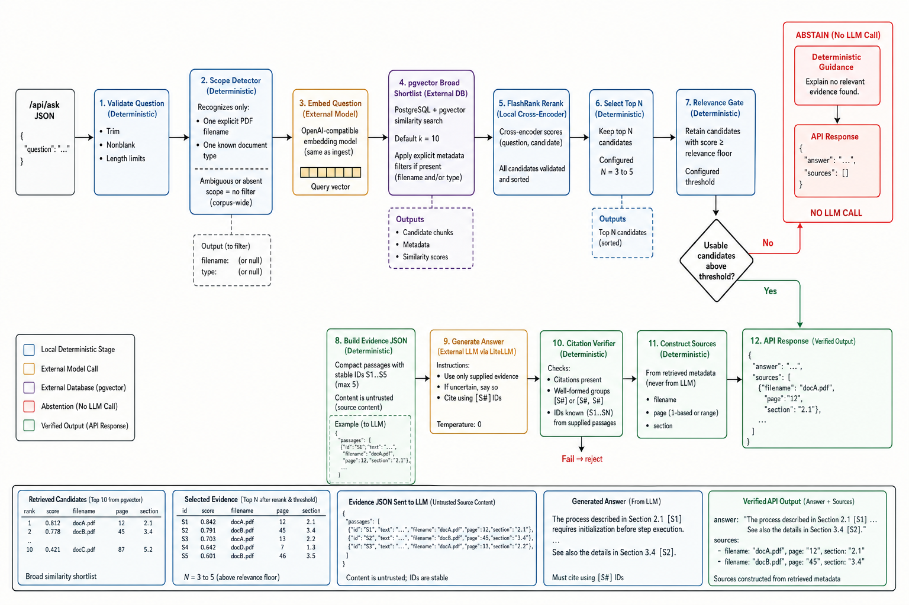

# Document Intelligence Service — Design & Decisions

The service uses FastAPI and Pydantic for the fixed API contract, request
validation, and HTTP error mapping. Extraction renders scanned PDFs with
PyMuPDF, recognizes every page with Tesseract, detects `PERSON` spans with
spaCy, converts OCR boxes to PDF coordinates, and compares normalized full names
with `thefuzz`. Ingestion reuses OCR, applies deterministic structure-aware
chunking, creates OpenAI-compatible embeddings, and stores chunks, source
metadata, and vectors in PostgreSQL with pgvector. Question answering combines
pgvector retrieval, local FlashRank cross-encoder reranking, an evidence gate,
provider-neutral generation through LiteLLM, and deterministic citation
verification. Use-case orchestrators depend on application `Protocol`s wired in
a composition root, keeping external dependencies replaceable in tests and all
operational settings environment-overridable.

## Component and sequence views

### `POST /api/extract`

Validate the PDF and submitted names, OCR every page, detect and locate `PERSON`
occurrences, then fuzzy-match complete normalized names. Located occurrences and
qualifying matches remain separate response collections.

### `POST /api/ingest`

Assign a unique document ID, OCR and recover structure, create word-safe chunks,
attach source context, batch embeddings, and verify the pgvector write result.

### `POST /api/ask`

Scope and embed the question, retrieve and rerank evidence, abstain when evidence
is weak, and otherwise generate an answer whose citations are verified before
sources are returned.

Local deterministic stages surround probabilistic dependencies. Coordinates are
normalized before leaving OCR, evidence is approved before generation, and API
sources are constructed after—not by—the LLM.

## Notable decisions and trade-offs

| Decision | Rationale | Accepted trade-off |
|---|---|---|
| PyMuPDF + local Tesseract | Auditable geometry, every-page OCR, document privacy | CPU-heavy; noisy/multilingual scans may need preprocessing or another OCR adapter |
| Small local spaCy NER | Fast `PERSON` spans with direct offsets | Lower noisy-scan recall than transformer/cloud NER |
| Normalized `thefuzz.ratio` | Explainable, accent/OCR-tolerant full-name matching | Threshold tuning; no nickname or order semantics |
| Deterministic structure-aware chunks | Predictable cost, whole words, source/page traceability | Heuristics are weaker on tables and complex layouts |
| PostgreSQL + pgvector | Durable vectors and filterable metadata in one store | More operations than embedded Chroma; specialist stores may scale farther |
| Remote embeddings + local reranker + LiteLLM | Semantic recall, cheap precision stage, provider portability | Network latency, quotas, and credentials require timeouts/retries |
| Evidence gate + citation verifier | Abstains early and prevents invented API sources | Can reject useful low-score evidence; valid citations do not prove claim entailment |

## Scaling to 1,000+ PDFs/hour

The current synchronous pipeline is appropriate for the take-home; blocking work
runs in a thread pool, protecting the event loop. At target load, upload once to
object storage, create an idempotent job keyed by tenant + content hash, enqueue
it, and return a job ID (or retain this endpoint as a bounded-wait facade). A
durable workflow fans page OCR/NER out to CPU/GPU workers, joins pages in index
order, batches embeddings within provider quotas, and transactionally bulk-writes
chunks. Each stage retries idempotently; exhausted jobs enter a dead-letter queue.

Capacity is page-driven:
`ceil(1000 × mean_pages × p95_seconds_per_page / (3600 × target_utilization))`.
At 10 pages/PDF, 2 s/page, and 70% utilization, start with 8 OCR slots and
provision about 12 for burst/headroom, then load-test. Scale on queue age and
stage latency. PostgreSQL uses bounded pools; add HNSW only after corpus-specific
recall/latency tests, then partition or separate reads if contention appears.
Track page throughput, stage P95, OCR confidence, located/NER ratio, abstention,
retries, queue age, model cost, and citation failures as SLO signals.

## Failure modes and mitigations

| Failure | Behavior / mitigation |
|---|---|
| Empty, oversized, spoofed, corrupt, protected PDF; bad names/question | Reject before models with 400/413/415/422; inspect bytes with PyMuPDF and close handles in `finally` |
| OCR/NER failure or unlocatable span | Per-page OCR timeout and typed 503; omit/log an unlocatable mention rather than return a false audit box; alert on located/NER ratio |
| Embedding/LLM timeout or malformed output | Bounded retries/timeouts; validate vectors and finish state; invalid upstream response → 502, unavailable dependency → 503 |
| PostgreSQL disconnect or partial write | Pre-ping, connect/statement timeouts, exponential retry, UUID IDs, and exact stored-ID/count verification |
| Irrelevant retrieval, prompt injection, invented source | Explicit-only filters, reranking, evidence gate, content marked untrusted, no LLM on weak evidence, citations resolved only against supplied passages |

## Routing models by query complexity

Today one answer model is configured. A future deterministic router runs **after
retrieval and the evidence gate**: no evidence → no model; one high-confidence
passage plus fact lookup → small/cheap model; comparison, aggregation, multiple
documents/sections, long context, or a narrow reranker-score margin → stronger
long-context model. Both routes receive the same approved evidence and citation
verification. One escalation is allowed for truncation or invalid citations;
otherwise return a controlled error, never an unverified answer. Offline
evaluation sets thresholds using answer correctness, citation precision/recall,
abstention quality, latency, and cost—not model self-assessment.
